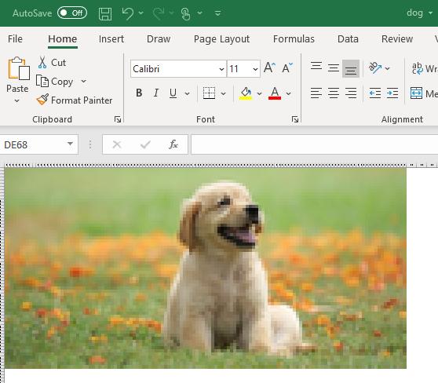

# img2xl
## Export Image files to Excel File - Use Cells as Pixels

Inspired by Matt Parker's [YouTube video](https://www.youtube.com/watch?v=UBX2QQHlQ_I) where he showed how image pixels can be expressed as Excel cells.


**Description**: This is a simple program that takes a user defined image file, optionally shrinks it, and then saves it in an Excel file at the same location of the original image's location. <br>

**Features**: <br>
- User supplied image _(.jpg or .png files)_ is converted from RGB to HEX pixels.<br>
- Individual cells of Excel sheet are treated as pixels of the image, and openpyxl.styles.PatternFill is used to color these cells according to the values of pixel colors.<br>
- Optinally, user can resize (shrink or expand) the image before exporting it to excel file as well.<br>
- Resulting Excel file is saved at the same location as original file.<br>
<br>

**Imports**: Functions imports the following libraries. So ensure they are installed before using them.
```Python
import os
import PIL
import openpyxl
```

**Usage**: 
```Python
from img2xl import img2xl
# Manual Inputs: Only the name of the image path
img_src = r'assets/dog.jpg'

# Calling functions from img2xl
img2xl(img_src, True, 0.2)
```

**Sample Image**<br>


**Resulting Image in Excel sheet after using img2xl**<br>

